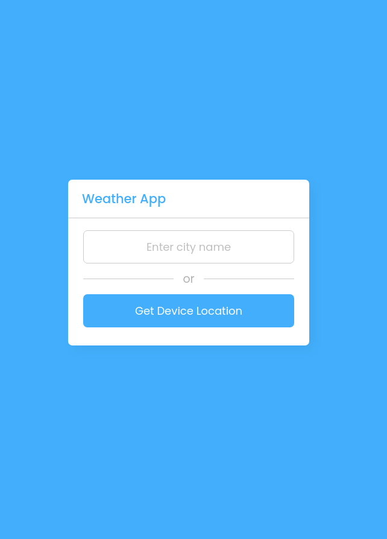

<h1 align="center">
  <a href="https://samucatezu.github.io/WeatherApp/">Site do programa :cloud: </a>
</h1>

<h1 align="center" ">
  Home page
</h1>

<h1 align="center" style="display: grid;">
  
</h1>

<h1 align="center" ">
  condições climáticas
</h1>

<h1 style="display: flex" align="center">
  
</h1>

 

## 🚀 Tecnologias
Projeto desenvolvido com as seguintes tecnologias:

- CSS
- HTML5
- JavaScript: addEventListener, fetchData
- WeatherAPI                                                                                                                                 
                                                                  
<a href="https://www.youtube.com/watch?v=c1r-NqYkFPc&t=2155s">Tutorial </a>
                                                                  

## 💻 Projeto

Um projeto simples para entender e obter mais conhecimento sobre JavaScript e suas funcionalidades. Nele, o user pode pesquisar por uma cidade e o programa responde-o mostrando as condições climáticas naquele dado momento 

